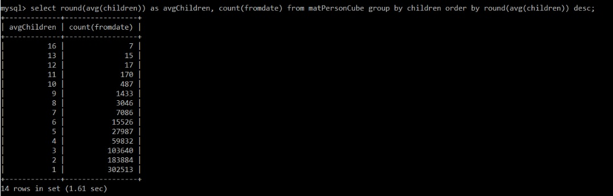
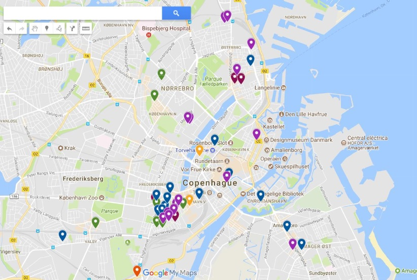

# CPH Police Competition - [IT University of Copenhagen](https://en.itu.dk/)

&nbsp;

### SQL queries on the Copenhagen Police Records

Award in the category 'Most interesting historical fact'  🏆

I wanted to know if the number of changing address has a relation with the number of children on average. Also, if people have preferences in living in some areas depending on the number of children they have.

Variable names have been changed and some details are hidden due to confidentiality and preservation of data privacy.

&nbsp;

                                                _ _ _---|Queries|---_ _ _

&nbsp;

- [x] __Creating a view__

create view totalChildren as (select persId, count(*) children
from relationship
where rel='parent'
group by persId)

- [x] __Create a Cube__

create view personCube as
(select person.id, gender, birthdate, fromdate, street, strnro, lat, lon, children, job
from person, address, totalChildren, position
where person.id = address.persId and person.id = totalChildren.persId and person.id = position.persId);

- [x] __Materialize the Cube__

create table matPersonCube as (select birthdate, fromdate, street, strnro, lat, lon, children
occupation, count(*) c from personCube group by birthdate, fromdate, street, strnro, lat, lon, children, job)

- [x] __Create indexes for Cube__

create index idx1 on matPersonCube(children, fromdate, job);
create index idx2 on matPersonCube(children, lat, lon, street, strnro);

- [x] __Distribution of changing address__

select round(avg(children)) as avgChildren, count(fromdate) from matPersonCube group by children order by round(avg(children))
desc;

- [x] __Distribution of locations in 2000__

select round(avg(children)) as avgChildren, lat, lon, street, strnro from matPersonCube where lat is NOT NULL and
lon is NOT NULL and year(fromdate) = 2000 group by lat, lon, street order by round(avg(children)) desc;

&nbsp;

                                                _ _ _---|Results|---_ _ _
  &nbsp;
 
 __Finding: The more children you have, the less you change locations.__
 
 
 
  &nbsp;
 
 __Distribution of locations in 2000.__
 
 

                                         

